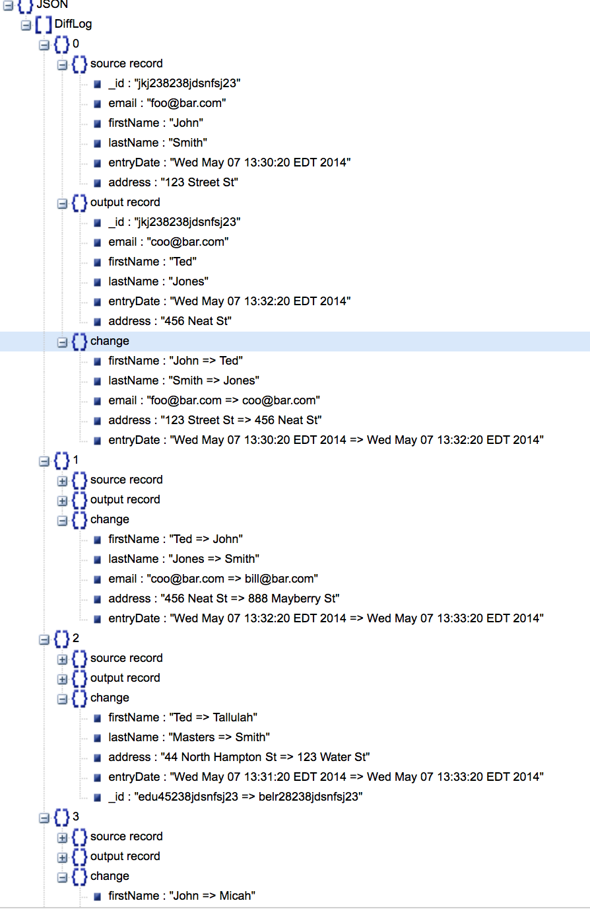
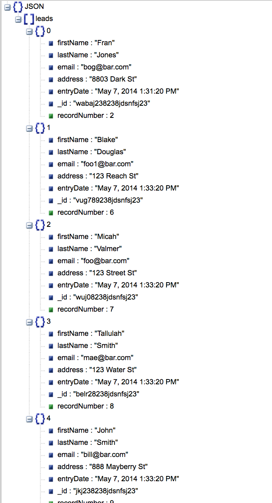

# Coding challenge for Zahra Iman

**Assumption #1**. All the data fits in memory, therefore I do not worry about streaming the data 

**Assumption #2**. The method I choose 
	(a) sorts all the records by  a key (in this case Id) and picks the last record (based on date first followed by order of recording), then 
	(b) sorts these remaining records by the other key (in this case Email) and takes the last record (based on date first followed by order of recording) which should get us the latest record with unique Id and Email.
	*** The other of the checking keys does not matter and the end result will be the same
	*** This is more reasonable than picking one record out of all records that either share an id or an email since that way there is a higher chance of losing acutally important information. This method might forget about an old email but since these records are duplicated, I expect the newest one to make the most sense.

**Assumption #3**. The changes are logged assuming to be for the purpose of change tracking. The changes are logged in the format of JSON showing the "source record", "output record", and "changes from to". This is tracked by logger and the assumption is that the project is not gonna be run multi-threaded in which case I need to either use SiftingAppender or modify the auditing method.

**Assumption #4**. The input json file follows the format given in the example, starting by "leads" as root and then having records with specific fields.

The main method is called "deduplicate" and resideds in service/Deduplicator.
The configuation of the project is defined in pom.xml.

  
  <figcaption>Example of diffLogger output</figcaption>

  
  <figcaption>Example of leads_output</figcaption>

Please email me at zahra.iman87@gmail.com with any questions.
